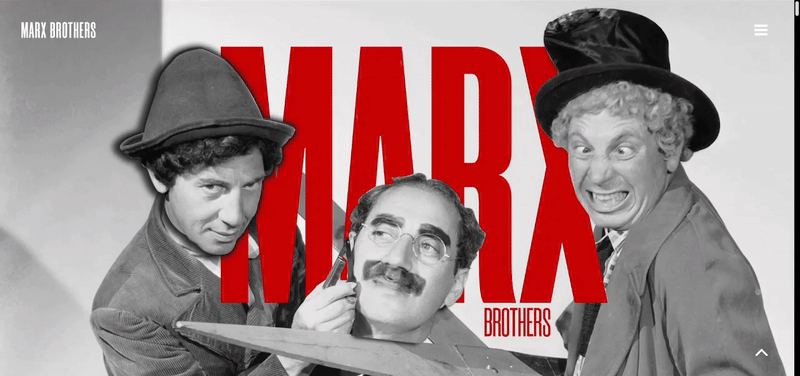

# 🎭 Marx Brothers Website

The **Marx Brothers Website** is a fully responsive site showcasing the iconic comedy troupe. The website is optimized for different screen sizes, ensuring a seamless experience across all devices. The project focuses on improving user experience while maintaining a consistent design. This project was a freelance project.

---

### 📦 Tech Stack

- 🎨 Custom CSS – Handled design optimization and responsiveness
- 📱 Responsive Design – Ensured compatibility across mobile, tablet, and desktop
- 🖥️ HTML5 – Structured semantic content for accessibility
- 🖋️ JavaScript – Enhanced interactivity and animations

---

### 🖼️ How It Works

Here’s a GIF demonstrating how the website works:



This is the first section:


This is the second section:


This is the third section:


---

### 🚀 How to Run Locally

1. Clone this repository:
   ```bash
   git clone https://github.com/shanmuckh/marxbrothers.git
   cd marxbrothers
   ```
2. Open the project folder and open `index.html` in any browser to see the website in action.

---

### 💡 Features

- 📱 Fully responsive layout, optimized for mobile, tablet, and desktop.
- 🎨 Clean, consistent design with an emphasis on user experience.
- 🔄 Smooth animations and interactions.
- 🖥️ Fast loading speeds, making use of minimal resources.


